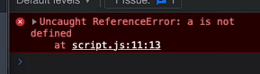

# Java-Script

# 01_Basics folder -> 01_Basics folder contains basics concepts 
1) lecture 01_variables
2) lecture 02_Data types in java script
3) lecture 03_conversion operations in java script
4) lecture 04_Strings basics concepts and methods of strings 
5) lecture 06_data types summary
6) lecture 07_numbers system in java script 
7) lecture 08_dates in java scrip and differet method to use dates in java script

# 02_Basics folder
1) lecture 01_arrays(basics operations like push ,pop, remove ,add,slice ,splice,unshift ,shift)
2) lecture 02_arrays(operations like concatination,spread,flat,isArray,From,of)
3) lecture 03_objects(object creation, objects declaration,syble creation abd declaration,function creation calling)
4) lecture 04_objects(declaring objects ,merging two or more objects through different ways)
5) lecture 05_objects(Desturcturing of objects,APIs,JSON -> java script object notation)

# 03_Basics folder
1) lecture 01_functions(defination, syntax,example,and execution ,properties ,different ways of creating a function)
2) lecture 02_functions()
3) lecture 03_scopes-> block scope and global scope
4) lecture 04_scope_levels
5) lecture 05_Arrow functions(syntax ,examples,ways of creating arrow functins,implicit return and explicite return ,use of this keyword)
6) lecture 06_IIFE -> Immediately invoked function expression, why we use IIFe, syntax,
   
# 04_Intermediate folder
1) lecture 01_js Execution(java script execution process),
2) lecture 02_Control flow(if else cases , Syntax and Examples,logical operators)
4) lecture 03_Swictch Statement(syntax,examples)
5) lecture 04_truthy and falsy values
6) lecture 05_loops and iterations
7) lecture 06_whileloop and do while loop (syntax and examples)
8) lecture 07_AdvanceLoops(for in, for off, for each loops,syntax and peactical examples)
9) lecture 08,09_forEach loop and Filter_implimentation

# 05_Dom 
1) lecture 01_DOM,HtML syntax,HTML Collections,
2) lecture 02_DOM_Basics
3) lecture 03_Dom_element creation
4) lecture 04_Dom Creation of Node List
5) lecture 05_How to edit, delete and create elements in DOM
6) 

# 06_Projects_In_Java_Script
1) project 01_JavaScript Background Color Switcher
2) project 02_Body Mass Calculator
3) Digital Clock
4) Number guessing game

# 07_Events and Project_In_Java_Script
1) Lecture_01_Event handling, on click event, Propogation, stop propogation, types of event propogation, Bubling and caputring
2) Lecture_02_Synchronous and Asynchronous language, file system, java script engine 

# 08_Projects_In_Java_Script
1) Lecture_01_Use of setTimeout function
2) Lecture_02_Use of setTimeout and clear timeout  function
3) Lecture_03_Key board checker
3) Lecture_04_Unlimited color changing

 # 09_API Request and V8 engine
 1) Lecture_01_Notes ,Concept
    
 # 10_Promises
 1) Lecture_01_Notes, Example ,Concept
    
 # 11_Fetch
 1) Lecture_01_Notes,Example ,Concept
    
 # 12_OOPS (object oriented programming in javaScript)
 1) Lecture_01_Notes ,Concept
    
 # 13_Prototyping
 1) Lecture_01

 # 14_Bind
 1) Lecture -Example why we are using wind
 # 15 getter and setter
 1)Lecture - Topic Remainig

 
---
## Explanation
- **internal linking and external linking in java Script**

- Internal linking means writing JavaScript code inside the HTML file, usually within the <script> tag.

- external linking means writing javaScript code in  a separate .js file and linking it to the HTML using <script src="...">
- 

---     
## variable in java Script

- Variables  
- var
- DataType varName =value: strongly type languages like java, C++, and c

- java script is loosely type language it does not have data types and in this types of languages dynamically  data types will be assigned

- we don't have to assign data type to java script it automatically assign data type to variables according to which type of data we are assigning to a particular variable
--- 
- **variable naming convention**
- firstname
- first_name
- FirstName
- firstName
- firstName(camel casing is more preferable)
- 

- ** Invalid naming convention**
- 1age it is invalid way
- 5firstname it is also a invalid way
- #name it is also a invalid way
---
# three variables in javascript
- var - Scope of var key word is global
- const - const is used when we don't have to  update the value of a variable again and again

- **let**- this key word is used when we have to re initialized the values of variables (the scope of let variable  is local)

this will gave an error

- **const**- we preferred to use it when the value of a variable is initialized only once (scope of the variable is local) or we cannot resign the value of the variables
- we have to assign value to a const variable we can not left it without assigning a value

- in case of productions most of the time it is preferred to use const 

---

## Objects in java script and why we create objects in Java Script

- Grouping related data together: instead of many separate variables like personName, personAge,personAddress, we can use an object like person={name:"",age:"",...address:""..}
- Encapsulating functionality + Data
- Organization and maintainability of the code
- avoiding pollution of the pollution of the global namespace / improving scope control 

---
# what is  object Destructuring
- Object destructuring means taking properties out of an object and placing them into variables in one quick step
---
#  what are the common difference between arrow functions and  normal functions in java script
- the first difference is of syntax
- the second difference is of arguments object 
- arrow function does not use arguments objects where as simple functions can use arguments objects in java script
- 
---
# ✅ What is Hoisting?

* Hoisting means JavaScript automatically moves variable and function declarations to the top of their scope before code runs.
## why we use hoisting and why this concept is invented ?
- Hoisting in JavaScript is a mechanism where variable and function declarations are moved to the top of their containing scope during the compilation phase, before the code is executed. This means that you can use functions and variables before they are formally declared in your code. 

- **note** we can not do hoisting in case of arrow functions 
---